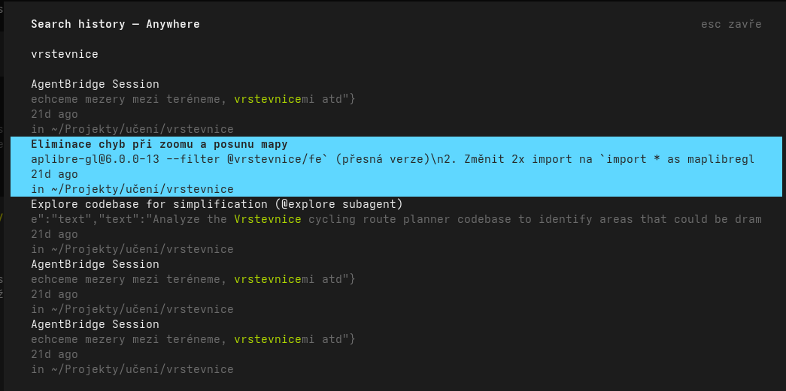

# opencode-history-fulltext-search



A [opencode](https://github.com/anomalyco/opencode) TUI plugin that adds **full-text search over your session history** to the command palette. Search across session titles and message content, with two scopes: the current directory, or everywhere.

> ⚠️ **Experimental.** This plugin is in the testing phase and reads a large local SQLite database on every search, which may slow down opencode.

## Features

- **Full-text search** across `session.title` + message content.
- **Two scopes**: `Search history — This dir` (current directory) or `Search history — Anywhere` (all sessions).
- **Live filtering** with the match highlighted and centered in a single-line snippet.
- **Noise filtering** — indexes only `text`/`reasoning` parts, ignoring tool I/O, step markers, patches and other operational noise.
- **Cross-dir resume** — selecting a session from another directory copies the exact resume command (`cd '<dir>' && opencode --session <id>`) to the clipboard instead of switching context.

## Install

Add one line to `~/.config/opencode/tui.json`:

```jsonc
{
  "$schema": "https://opencode.ai/tui.json",
  "plugin": ["opencode-history-fulltext-search"]
}
```

Or via the CLI (patches the config for you):

```bash
opencode plugin opencode-history-fulltext-search
```

Then restart opencode — the package and its dependencies are installed automatically.

> Not published to npm yet? Install directly from GitHub:
> ```jsonc
> { "plugin": ["opencode-history-fulltext-search@github:forstjiri/opencode-history-fulltext-search"] }
> ```

## Usage

1. Open the command palette (`Ctrl+P`).
2. Run **Search history — This dir** or **Search history — Anywhere**.
3. Type to filter; `Enter` to open the session (*This dir*) or copy the resume command (*Anywhere*); `Esc` to close.

## How it works

- Reads `~/.local/share/opencode/opencode.db` **read-only** (WAL-safe).
- Content filter: only `part.data.type` of `text` or `reasoning`, excluding `synthetic` rows — drops ~70% of rows that are pure operational noise.
- Clipboard tool is auto-detected (`wl-copy` → `xclip` → `xsel`).

## License

MIT — see [LICENSE](./LICENSE).
